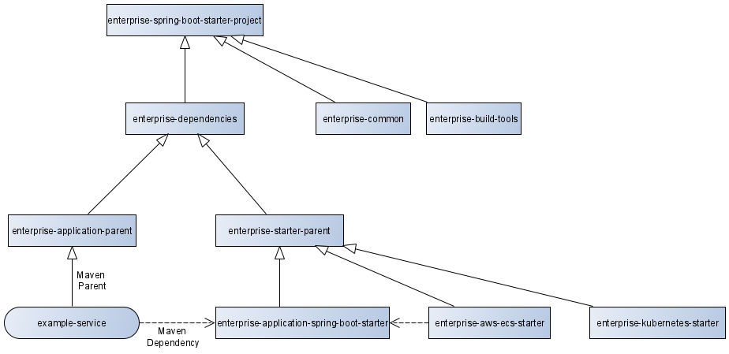

# Übersicht über die Maven-Module
Die Ordner- und Abhängigkeits-Struktur wurde an die bei [Spring Boot](https://github.com/spring-projects/spring-boot) verwendete Struktur angelehnt. Folgendes Diagramm zeigt die Vererbungs- und Abhängigkeits-Struktur in Maven:

_enterprise-common_ und _enterprise-build-tools_ werden in den beiden Parents eingebunden, diese Abhängigkeit wurde aus Gründen der Übersichtlichkeit weggelassen.

Hier eine Kurzbeschreibung für jedes Artefakt, weitere Dokumentation ist den Readme-Dateien der einzelnen Projekte zu finden:
- __enterprise-spring-boot-starter-project__  
Definiert die Maven-Module. Notwendig für den Build-Prozess, damit alle Artefakte gebaut werden.
- __enterprise-common__  
Gemeinsam genutzte Basis-Klassen - keine Spring-Abhängigkeiten.
- __enterprise-build-tools__  
IDE-Einrichtung und Dateien für den Build-Prozess (z.B. Checkstyle-Regeln)
- __enterprise-dependencies__  
Definition von Versionen von Maven-Dependencies und -Modulen
- __enterprise-application-parent__  
Maven-Abhängigkeiten und Konfigurationen für den Build-Prozess von Services 
- __enterprise-starter-parent__  
Maven-Abhängigkeiten und Konfigurationen für den Build-Prozess von Startern
- __enterprise-application-spring-boot-starter__  
Herzstück, der "eigentliche" Enterprise-Starter. 

Die beiden Artefakte __enterprise-aws-starter__ und __enterprise-kubernetes-starter__ zeigen exemplarisch, dass weitere (bereits bestehende oder noch zu entwickelnde) Starter den _enterprise-starter-parent_ als Maven-Parent verwenden sollen.
