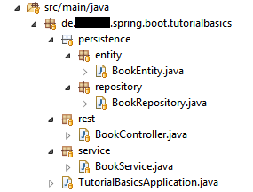
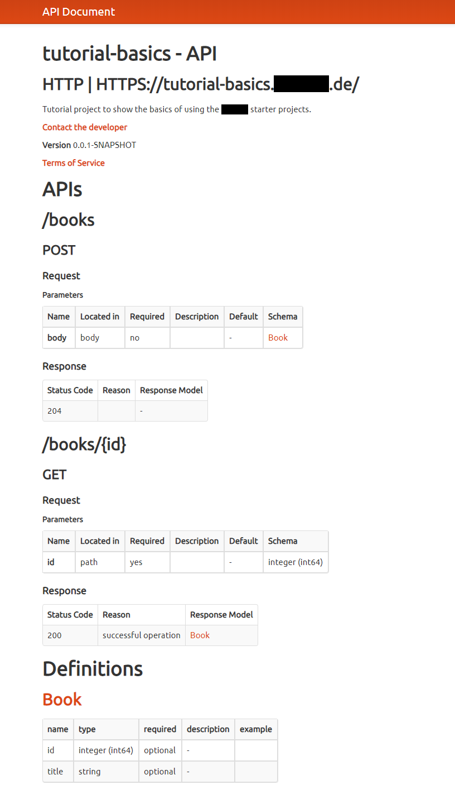
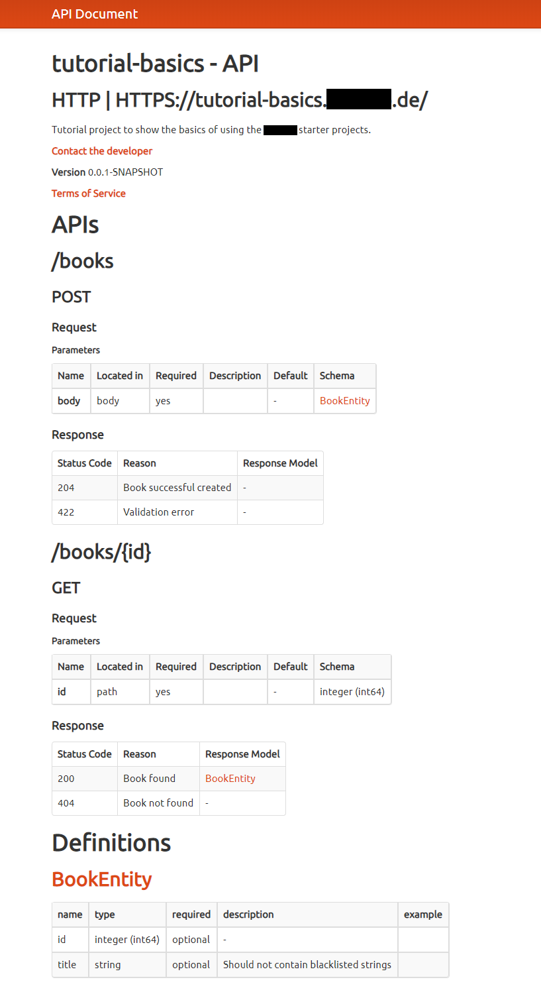

# Basis Tutorial zum Enterprise-Spring-Boot-Starter

__Überblick__

Dieses Tutorial zeigt einige Features des Enterprise-Starters im Detail. Das Tutorial ist so aufgebaut, dass jeder Schritt nachprogrammiert und ausprobiert werden kann.

__Inhalt dieses Tutorials__
- [Verbessertes Property-Handling für die lokale Ausführung](./tutorial-basics.md#verbessertes-property-handling-für-die-lokale-ausführung)
- [Erweitertes Exception-Handling](./tutorial-basics.md#erweitertes-exception-handling)
- [Swagger Integration](./tutorial-basics.md#swagger-integration)

## Verbessertes Property-Handling für die lokale Ausführung

### Spring Profile und Property-Dateien

In einer Spring-Boot-Anwendung kann über das Setzen eines oder mehrerer Profile definiert werden, welche Property-Dateien beim Start einer Anwendung verwendet werden. Es bietet sich an, über die Profile die verschiedenen Umgebungen (z.B. Dev, Test, Prod) abzubilden.

Per Default sucht Spring immer nach der Datei `application.properties`, welche die allgemeinen Properties enthält. Ist ein Spring-Profil aktiv, wird zusätzlich eine Datei mit Namen `application-{profil}.properties` gesucht, die spezielle Properties für dieses Profil enthält. Ist ein Property-Wert in beiden Dateien gesetzt, wird immer der aus der Profil-spezifischen Datei, also der speziellere Wert, verwendet.

### Anwendung starten mit aktivem Profil

Zum Ausprobieren müssen folgende Werte in der Datei `application.properties` ergänzt werden: 

```ini
info.tutorial.wert1=root
info.tutorial.wert2=root
info.tutorial.wert3=root
info.tutorial.wert4=root
```

Und in `application-dev.properties`:
```
info.tutorial.wert2=dev
info.tutorial.wert3=dev
info.tutorial.wert4=dev
```
Die Angabe von Properties mit Präfix `info` lassen die Werte im Actuator-Info-Endpunkt (`/manage/info`) erscheinen. 

Die Anwendung kann mit aktivem Spring-Profil `dev` wie folgt über die Kommandozeile gestartet werden:

```
> mvn -Dspring.profiles.active=dev spring-boot:run
```

Unter http://localhost:8080/manage/info ist nun folgende Ausgabe zu sehen:

```json
"tutorial": {
	"wert1": "root",
	"wert2": "dev",
	"wert3": "dev",
	"wert4": "dev"
},
...
```

Hier ist zu erkennen, dass bei mehrfach definierten Properties die spezielleren aus der Datei `application-dev.properties` die allgemeineren  aus der Datei `application.properties` überschrieben haben. Bis hier ist das noch alles Teil der Standard-Spring-Boot-Funktionalität.

> __Tipp__ Beim Starten einer Spring-Boot-Anwendung ist in den ersten Zeilen der Log-Ausgabe zu sehen, welche Profile gerade aktiv sind. Hier ein Beispiel:
>
> `23:55:48.902 INFO   d.a.s.b.t.TutorialBasicsApplication - The following profiles are active: dev
`

__Property-Feature aus dem Enterprise-Starter__

Der Enterprise-Starter enthält einen Mechanismus, der dann, wenn keine Spring-Profile beim Start gesetzt sind, folgende Profile aktiviert: `dev`, `dev-local` und `{Computername}`. Dadurch werden folgende Property-Dateien verwendet (je weiter unten, desto spezieller):
- `application.properties`
- `application-dev.properties`
- `application-dev-local.properties`
- `application-{Computername}.properties`

Dieses Setup hat sich für die lokale Entwicklung bewährt. Durch das Verwenden der Dev-Properties ist zum Beispiel der Zugriff auf Mock-Services aus der Dev-Umgebung möglich. In den Dev-Local-Properties könnnen Properties definiert werden, die für alle Entwickler beim lokalen Starten gelten sollen. Ein sinnvolles Beispiel dafür ist die Verwendung einer In-Memory-Datenbank (z.B. H2) statt der Datenbank der Dev-Umgebung. Die letzte Property-Datei mit dem Computernamen dient dazu, persönliche Einstellungen, wie zum Beispiel Credentials, zu definieren, die nicht mit anderen Entwicklern geteilt werden sollen.

> __Hinweis für Linux und Mac-User__: Damit dieses Feature wie vorgesehen funktioniert, muss die Umgebungsvariable `COMPUTERNAME` gesetzt werden. Bei Windows ist diese automatische gefüllt.

Um dies zu testen, müssen folgende Zeilen in der Datei `application-dev-local.properties` ergänzt werden:

```
info.tutorial.wert3=dev-local
info.tutorial.wert4=dev-local
```

und eine Property-Datei mit dem eigenen Rechnernamen angelegt werden, als Beispiel `application-HAM00780.properties`, mit folgendem Inhalt:

```
info.tutorial.wert4=local machine
```


Die Anwendung kann jetzt, ohne explizit definiertes Spring-Profil, gestartet werden:
```
> mvn spring-boot:run
```

In der Logausgabe sollte jetzt zu sehen sein, dass die drei erwarteten Profile (`dev`, `dev-local` und `{Computername}`) aktiv sind. Unter http://localhost:8080/manage/info ist nun folgende Ausgabe zu sehen:

```
"tutorial": {
    "wert1": "root",
    "wert2": "dev",
    "wert3": "dev-local",
    "wert4": "local machine"
},
...
```
## Erweitertes Exception-Handling
Spring Web MVC bringt standardmäßig ein Exception-Handling für gewisse Exceptions mit. So wird zum Beispiel eine `HttpMediaTypeNotSupportedException` von Spring immer auf den HttpStatus 415 (Unsupported Media Type) gemapped.

Spring Web MVC bietet auch die Möglichkeit, eigenes ExceptionHandling zu konfigurieren, hauptsächlich mit den beiden Annotationen `@ControllerAdvice` und `@ExceptionHandler`.

Mit Hilfe dieses Features ist im Enterprise-Starter ist für einige geläufige Fälle ein Exception-Handling eingebaut. Im folgenden Beispiel verwenden wir die `ValidationException` die auf den Http-Status 422 (Unprocessable Entity) gemapped wird, sowie die `ResourceNotFoundException, gemapped auf 404 (Not Found). Eine vollständige Liste der Exceptions und zugehörigen Http-Stati findet sich [hier](../enterprise-application-spring-boot-starter/README.md#spezielle-exceptions-inkl-exceptionhandler).

### Erstes Beispiel GET /books/{id}
Hier die Package-Struktur des Beispielcodes:



BookEntity.java:
```java
@Data
public class BookEntity {
  private Long id;
  private String title;
}
```

BookRepository.java:
```java
@Service
public class BookRepository {

  public BookEntity save(BookEntity book) {
    book.setId(1L);
    return book;
  }

  public Optional<BookEntity> findById(Long id) {
    if (id == 1L) {
      return Optional.of(new BookEntity());
    }
    return Optional.ofNullable(null);
  }
}
```

BookService.java:
```java
@Service
@AllArgsConstructor
public class BookService {

  private final BookRepository bookRepository;

  public Optional<BookEntity> getBook(Long id) {
    return this.bookRepository.findById(id);
  }
}
```

BookController.java
```java
@RestController
@AllArgsConstructor
public class BookController {

  private final BookService bookService;

  @GetMapping("/books/{id}")
  public ResponseEntity<?> getBook(@PathVariable("id") Long id) {
    Optional<BookEntity> bookOptional = this.bookService.getBook(id);
    if (bookOptional.isPresent()) {
      return ResponseEntity.ok(bookOptional.get());
    } 
    else {
      return ResponseEntity.notFound().build();
    }
  }
}
```

Das Beispielszenario hat eine Entity, sowie ein zugehöriges Repository, einen Service und einen Controller. Auf die Anbindung einer Datenbank wurde für dieses Tutorial verzichtet, daher sind an der Entity keine entsprechenden Annotationen (`@Entity`, `@Column` etc.) zu finden, und das Repository hat Mock-Funktionalität.

Der `BookController` bietet einen Get-Endpunkt, über den einzelne Bücher über ihre Id abgefragt werden können. Ist das Buch mit der gesuchten Id vorhanden, hat die Antwort den Http-Status 200 und die BookEntity wird als Body zurückgegeben. Gibt es das gesuchte Buch nicht, wird ein 404 (Not Found) zurückgegeben.

Mit Verwendung der im Enterprise-Starter enthaltenen `ResourceNotFoundException` kann die Methode `getBook` im Controller wesentlich vereinfacht werden:

```java
@GetMapping("/books/{id}")
public BookEntity getBook(@PathVariable("id") Long id) {
  return this.bookService.getBook(id)
      .orElseThrow(ResourceNotFoundException::new);
}
```
Falls das aus dem Service zurückgegebene Optional einen Wert enthält, wird dieser, also ein Objekt der Klasse `BookEntity`, aus der `getBook` Methode zurückgegeben. Die Http-Antwort erfolgt in diesem Fall auch mit dem geänderten Code mit dem Http-Status 200, da dies der Default-Http-Status ist, der von einer Controller-Methode verwendet ist. Ist das Optional leer, wird eine `ResourceNotFoundException` geworfen. Im Enterprise-Starter ist über eine mit `@ExceptionHandler` annotierte Methode definiert, dass dann der Http-Status 404 verwendet wird.

Die vereinfachte Implementierung macht den Code wesentlich schlanker und es muss nur das Objekt behandelt werden, was als Body zurückgegeben wird. Es ist keine Verwendung der ResponseEntity notwendig.


### Zweites Beispiel POST /books
Eine Exception, für die ein Exception-Handling mit Http-Status definiert ist, muss nicht im Controller selber geworfen werden, sondern kann auch in der Service-Schicht geworfen werden. Dies schauen wir uns in einem zweiten Beispiel an. Hier wollen wir eine POST-Methode implementieren.

Zunächst die Erweiterung des `BookService`:

```java
public BookEntity createBook(BookEntity book) throws ValidationException {
  if (isTitleBlacklisted(book.getTitle())) {
    throw new ValidationException("book.create.title.blacklisted",
        "Book is not allowed to be created. Title is blacklisted - " + book);
  }
  return this.bookRepository.save(book);
}

private boolean isTitleBlacklisted(String title) {
  String[] blacklist = { "böse", "blöd" };
  return Arrays.stream(blacklist).anyMatch(b -> title.contains(b));
}
```

Die Methode `isTitleBlacklisted` enthält eine fachliche Validierung des eingehenden Objekts. In diesem Fall wird überprüft, ob der Titel des Buchs eine Zeichenkette enthält, die in einer Liste verbotener Zeichenketten enthalten ist. 
Wird in `createBook` festgestellt, dass der Titel nicht erlaubt ist, wird eine `ValidationException` geworfen. Ist der Titel erlaubt, wird das Buch gespeichert.

Im `BookController` wird die POST-Methode ergänzt:
```java
@ResponseStatus(HttpStatus.NO_CONTENT)
@PostMapping("/books")
public void postBook(@RequestBody BookEntity book) throws ValidationException {
  this.bookService.createBook(book);
}
```
Ist der Service-Aufruf erfolgreich, wird der Status 204 (No Content) zurückgegeben. Dies wird über die `@ResponseStatus`-Annotation definiert. Wird jedoch in `bookService.createBook(book)` eine `ValidationException` geworfen, ist der Rückgabestatus 422 (Unprocessable Entity), aufgrund des im Starter definierten Exceptionhandlings.
  

## Swagger Integration
Beim Build einer Anwendung mit integriertem Enterprise-Starter wird automatische eine Swagger-Api-Dokumentation erzeugt. Diese wird als JSON- (`swagger.json`) und HTML-Datei (`api.html`) abgelegt und ist im Ordner `target/classes/docs/` zu finden. Über den Endpunkt `/manage/api` werden diese Dateien auch in der laufenden Anwendung bereitgestellt. Welches Dokument ausgeliefert wird, hängt dabei vom verwendeten `Accept` Header ab.

> Alle Endpunkte unter dem Pfad `/manage` sind per Default mit einem Passwort geschützt - lediglich `/manage/info` und `/manage/health` sind ungeschützt erreichbar.
>
> Die Zugangsdaten werden über die Properties `spring.security.user.name` und `spring.security.user.password` konfiguriert. Das Passwort muss dabei BCrypt-gehashed abgelegt werden. 
>
> Die Default-Werte sind [hier](../enterprise-application-spring-boot-starter/src/main/resources/META-INF/application-default.properties) zu finden. Das Passwort ist im Kommentar auch in Klartext hinterlegt.

Bereits ohne explizite Verwendung von Swagger-Annotationen im Code wird eine Swagger-Api-Dokumentation generiert, die die in der Anwendung implementierten Endpunkte enthält. Das liegt daran, dass das [Swagger-Maven-Plugin](https://github.com/kongchen/swagger-maven-plugin), welches die Dokumentation generiert, den Code nach Spring-Controllern abscannt und aus den Spring-Annotationen die Endpunkt-Dokumentation generiert. 

Mit dem im vorherigen Kapitel entwickelten Beispielcode kann dies leicht ausprobiert werden. Wird die Anwendung gebaut (`mvn install` im Projektordner) findet sich danach folgende Html-Datei im Ordner `target/classes/docs/`:



Der obere Teil, sozusagen die Einleitung der Dokumentation, enthält Informationen aus der pom.xml, wie Artefakt-Id und Beschreibung. Danach folgen die einzelnen API-Endpunkte. Diese sehen schon sehr gut beschrieben aus, bei genauer Betrachtung fällt jedoch auf, dass die Dokumentation an einer Stelle nicht korrekt ist: Der Body beim POST-Endpunkt wird als nicht _required_ angegeben. Dies wurde nicht korrekt aus den Spring-Annotationen abgeleitet, bei Verwendung von `@RequestBody` ist der Default `required=true`.

Über die Swagger-Annotation `@ApiParam` kann dafür gesorgt werden, dass der Body korrekterweise als _required_ angegeben wird:

```java
@ResponseStatus(HttpStatus.NO_CONTENT)
@PostMapping("/books")
public void postBook(@RequestBody @ApiParam(required = true) BookEntity book) throws ValidationException {
  this.bookService.createBook(book);
} 
```

Um die Dokumentation zu vervollständigen, müssen auch die verschiedenen möglichen Http-Stati der Rückgabe explizit mittels Swagger-Annotationen angegeben werden. Per Default wird hier nur der Http-Status der erfolgreichen Rückgabe erkannt (204 für die POST-Methode bzw. 200 für die GET-Methode). Für die beiden Controller-Methoden sieht das so aus:

```java
@ApiResponses({
    @ApiResponse(code = 200, message = "Book found"),
    @ApiResponse(code = 404, message = "Book not found") })
@GetMapping("/books/{id}")
public BookEntity getBook(@PathVariable("id") Long id) {
  return this.bookService.getBook(id)
      .orElseThrow(ResourceNotFoundException::new);
}

@ApiResponses({
    @ApiResponse(code = 204, message = "Book successful created"),
    @ApiResponse(code = 422, message = "Validation error") })
@ResponseStatus(HttpStatus.NO_CONTENT)
@PostMapping("/books")
public void postBook(@RequestBody @ApiParam(required = true) BookEntity book) throws ValidationException {
  this.bookService.createBook(book);
}
```

Jetzt ist die API-Dokumentation erst einmal vollständig und korrekt. Eine weitere sinnvolle Optimierung wäre nun die Angabe von Kommentaren an Feldern der verwendeten Modell-Klassen. Diese können mittels der Annotation `@ApiModelProperty` direkt in der Klasse an den jeweiligen Feldern definiert werden.

```java
@Data
public class BookEntity {

  private Long id;

  @ApiModelProperty("Should not contain blacklisted strings")
  private String title;

}
```

Die optimierte Variante der Dokumentation sieht nach den Anpassungen dann so aus:



### Fazit zur Swagger-Integration
 Der Enterprise-Starter konfigurtiert die automatische API-Dokumentations-Generierung mit dem Plugin [swagger-maven-plugin](https://github.com/kongchen/swagger-maven-plugin). Der Großteil der Dokumentation wird automatisch aus den Spring-Web-Annotationen erzeugt. Es gibt aber einige Stellen an denen die Dokumentation nicht direkt korrekt und vollständig ist. Vor der Veröffentlichung einer so generierten API-Dokumentation sollte diese überprüft werden und ggf. durch Anbringen von Swagger-Annotationen im Code oder manuell in der Datei optimiert werden. Eine Übersicht über alle verwendbaren Swagger-Annotationen findet sich zum Beispiel [hier](https://github.com/swagger-api/swagger-core/wiki/annotations).


<!--- ## Weitere Ideen TODO
 - Tracing ?
 - Actuator Beispiel?
-->
